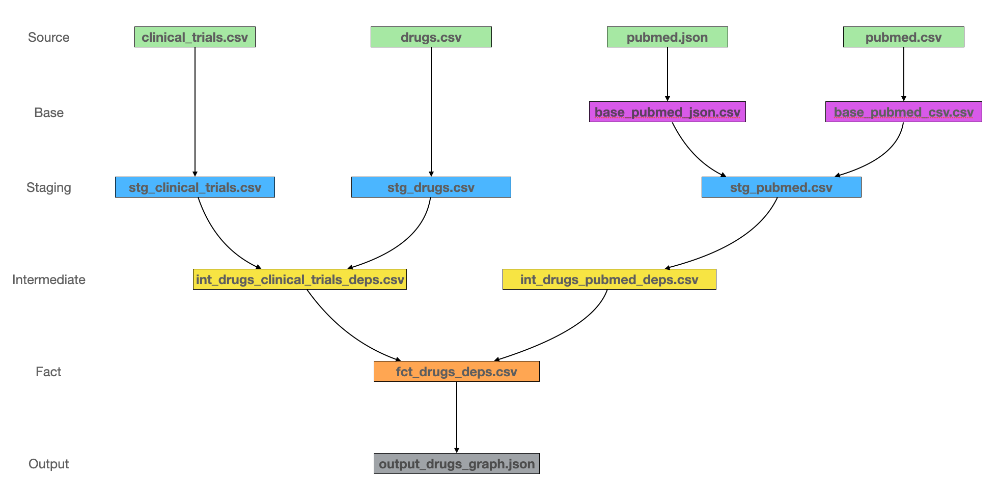

# Test Servier [Thomas Reynaud]

## Project Overview

The goal of this assignment is to build a dependencies graph between drugs and Pubmeds & Clinical Trials. A
dependency exists if and only if the drug is mentionned in the title of the publication.

### Data Pipeline

The pipeline that I built is heavily inspired by the modular data modeling technique suggested by DBT.

It is organized as so:



From the DBT documentation:
> The purpose of staging models (in our convention) is just to clean up and standardize the raw data coming from the warehouse, so we have consistency when we use them in downstream models. They are prefixed with `_stg`.

> Base models are prefixed with `base_` and live in the staging folder alongside stg_ models. If a subset of staging models from the same source lack utility on their own, it may make sense to join them together in a base model before moving downstream.

> The data mart layer is where we start applying business logic, and as a result, data mart models typically have heavier transformations than in staging. The purpose of these models is to build our business’s core data assets that will be used directly in downstream analysis. In our marts project folder our models are generally dimension and fact tables, so we prefix them with `dim_`, or `fct_`.

> Intermediate models are prefixed with `int_` and live within the marts folder. If your marts models are overly nested + complex to read, splitting some of the logic into one or more intermediate models will help with readability down the line.

For more details see: https://www.getdbt.com/analytics-engineering/modular-data-modeling-technique/

Basically, I've made it so it is extremely modular and each step can be reused in other pipelines, either by importing the code of the corresponding step OR by using the data that is stored in a table at the end of the step.

For instance, `int_drugs_pubmed_deps.csv` can be used if we are only interested in the dependencies between drugs and PubMed for further data modeling.

Each step has its own processing logic so the code is more readable and easy to maintain in case of a change in how the source files are written.

Obviously, in a production environment, the data would be written in an adequate data warehouse and not is csv files like so.

I used Pandas in this project to reduce the amount of code written, but this is not a hard requirement.

### Output

The output dependency graph can be found in `output/`. It is a JSON file where each item is an edge of the graph with its corresponding metadata, as follow:

    {
        "dependency_id":0,
        "drug_atcode":"A04AD",
        "drug_name":"DIPHENHYDRAMINE",
        "ref_type":"clinical_trial",
        "ref_id":"NCT04237091",
        "ref_title":"Feasibility of a Randomized Controlled Clinical Trial Comparing the Use of Cetirizine to Replace Diphenhydramine in the Prevention of Reactions Related to Paclitaxel",
        "date":"01\/01\/2020",
        "journal":"Journal of emergency nursing"
    }

The main benefit of this format is that it can live in tabular format as well, where each line is a dependency, and make it very easy and efficient to filter by date or ID with basic SQL.
To get the dependency between a drug and a clinical trial for instance, we just need to filter on `"ref_type" == "clinical_trial"`.

Note that a journal can contain many publications, hence mention the same drug multiple times at the same date which needs to be taken into account.

### Running the pipeline

The pipeline scripts and their steps live in the `dags/` folder.
Initially I wrote an airflow DAG in `airflow_pipeline.py` but I have a lot of troubles running Airflow locally, mainly because of RAM issues and workers timing out for unknown reasons. I believe though that the DAG is functionnal and can be run on an healthy Airflow image.

I also wrote a `backup_pipeline.py` to have a utility that runs all the steps in the right order. Is is not great code!

To run the code locally, first install the dependencies. I used Pipenv for convenience:

```
make set-up
```

For the airflow pipeline, first launch the Docker image:

```
make launch-airflow
```

Then
```
make run-airflow-pipeline
```

To only run the backup pipeline:
```
make run-backup-pipeline
```

I already pushed the data for each step in `data/` so it is easier for the reader to understand how it is formatted.

### On data quality

The assignment gives us data with quality issues. I chose to not spend too much time writing generic code to fix the data quality issues. This is usually a lengthy process where it is needed to understand the root causes of the issues and figure out to cleanest way to handle all possible cases. Since we lack context, I did not write a lot of boilerplate code to be as generic as possible and instead wrote ad-hoc fixes for the task at hand, which is obviously not good practice.

- The date is not formatted the same way across the different files -> reformat everything in d/m/y.
- clinical_trials.csv contains a duplicated line with missing values which can be aggregated to get a complete one.
- clinical_trials.csv contains titles with bytes like characters that have been removed with a regex.
- pubmed.json has a missing id that has been set to -1 since we don't really use IDs in this assignment.
- pubmed.json has ids in str and int which is corrected in the stg_pubmed.csv.

Again, I assumed that the task was not about writing a lot of generic code to handle all possible data quality issues, but just to identify them and fix them so the pipeline is not hindered.

### On code quality.

Docstrings, formatting (black), linting (flake8) and type hinting (mypy) are implemented.
The code is run inside a virtualenv with Pipenv.

I did not have time to write tests yet, if this is something that is expected in this assignment, I'll be happy to write some.
I also lacked time to add a propper logging funtionnality, it's only prints at the moment.
Finally, I also chose to not catch exception where there could be some. This is also needed.

Regarding versionning, there are only main and feature branches, no further distinction.

## Ad-Hoc Analysis

The code to answer Question 4 can be found in `adhoc_analysis/analysis.py`.
It basically groups the dependencies by journal name and then count the number of unique drug names. This is another advantage of the graph format we chose.

The output is the following:

>The journals mentioning the biggest number of drugs are: Journal of emergency nursing, Psychopharmacology, The journal of maternal-fetal & neonatal medicine.
>They mention 2 different drugs each.

The code can be run with:
```
make run-adhoc-analysis
```

## Scaling the pipeline

In order to handle larger volumes of data, this is what we could do:

- Add a date_added column to the source data so we can only run the pipeline on newer data and not recompute everything each time the pipeline is triggered. Particularly, if new drugs are added, only search those in publications. If a new PuybMeds or clinical trials are added, only search drugs on those. In the case of millions of files, only process the new ones.

- At the moment we load everything in memory which is untractable. Instead, we could read data in batches. Pandas supports optionally iterating or breaking of the file into chunks.

- Use map-reduce frameworks like Spark instead of pandas to load and process the data more efficiently. Our scheduler will just trigger the jobs instead.

- If possible, run some steps directly in SQL in the data warehouse. This is of couse not ideal for text related tasks like ours.

- Use a managed solution like Dataflow which allows us to only write the processing code with Apache Beam. It will handle all the parallelization work and resource management for us.


## SQL

The answers to the SQL questions are in `sql/`.

